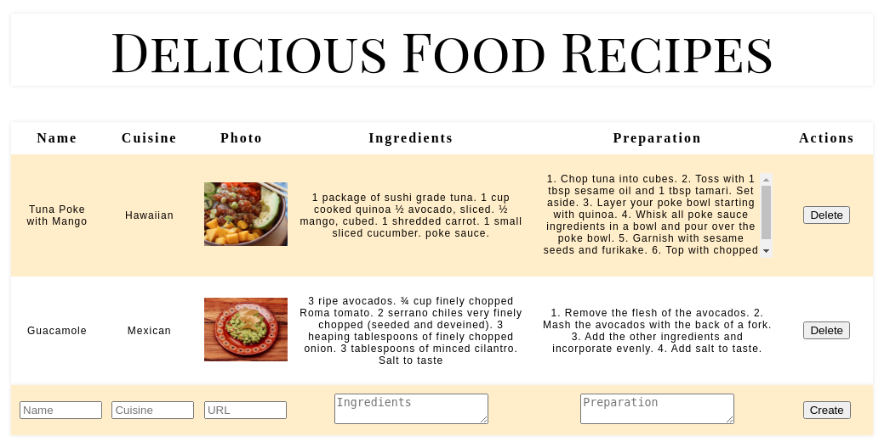

# React Recipe App

The app will display a recipe's name, cuisine, photo, ingredients, preparation instructions and action buttons (delete).

## Functionality

-User can create a recipe entry.

-User can read the list of recipes. The new recipe is added to the end of the list of recipes.

-User can delete a recipe.

-CSS was used to make the app look like the mockup below:

-Uses multiple components that play well together.

-Recipe data is contained in the state.
